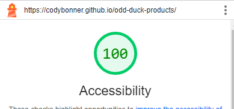

# odd-duck-products
odd duck product image selector repo using grid
Utilize constructors and CSS styling to produce interactive images allowing
future employees to select images and at the end showcase results.

# LAB - 5

## About Me

To utilize the skills and tools I have achieved to showcase a unique and personal webpage dedicated to letting others know just a bit more about me.

### Author: Cody Bonner

### Links and Resources
[Tyishas Sweets](https://www.tyishassweets.com/)
[Coolors Pallet](https://coolors.co/palette/8ecae6-219ebc-023047-ffb703-fb8500)
* [GitHub Class Repo](https://github.com/CodyBonner/code-challenges)

* 

### Lighthouse Accessibility Report Score

### Reflections and Comments

Learning Journal 3:

Paper View
The past couple weeks have been challenging but they have also been rewarding. I learned and struggled with object literals and constructors in the beginning but once I understood how to use them it became much easier. I still have a lot to learn about their capabilities. However I am enjoying utilizing the construction of HTML elements from inside of javascript so that way HTML does not stay super cluttered.

I look forward to learning more and developing my skills further.